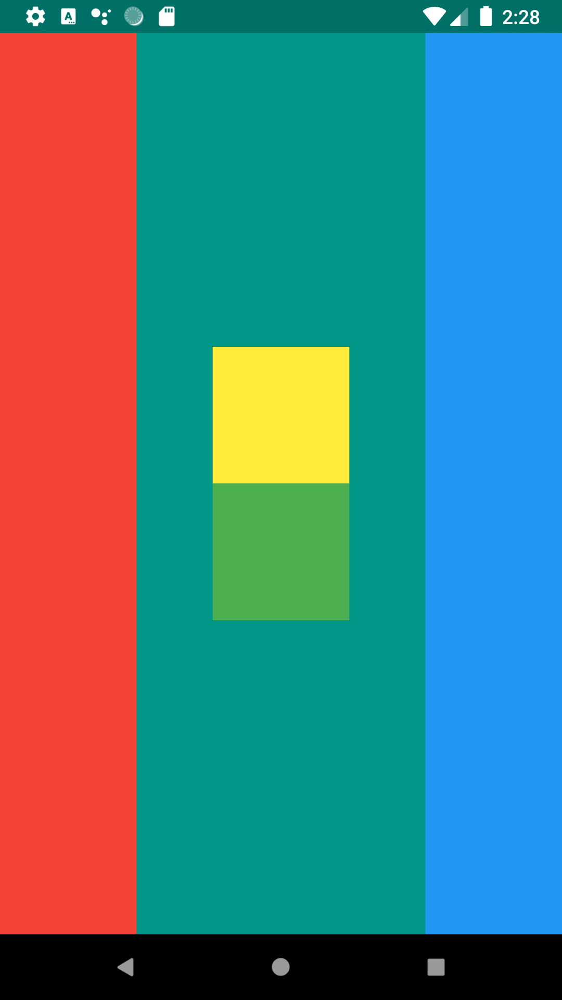

# row_and_columns

A Flutter application that display how the Row and the Column Widget works. (how they are laid out)

<!---  -->

This Application basically visualizes **Rows** and **Columns**

For more detailed information and better understanding, visit the link below

[Flutter Layout Cheat Sheet](https://medium.com/flutter-community/flutter-layout-cheat-sheet-5363348d037e "Flutter Layout")

_courtesy of:_ **The App Brewery**